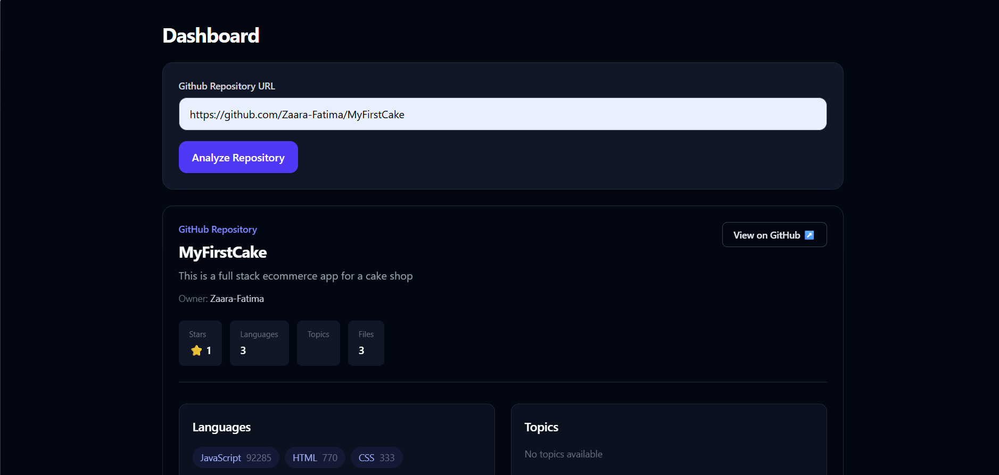
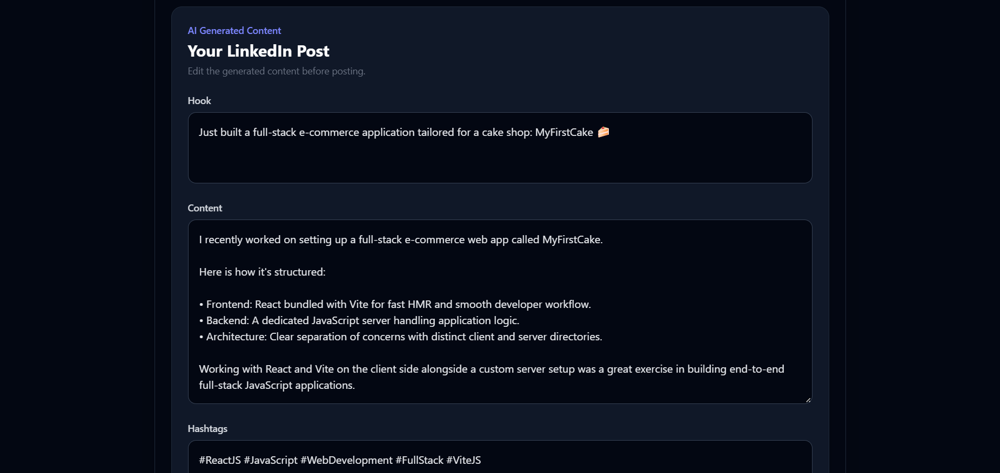

#Repo2Post

## About

Repo2Post is an AI-powered tool that analyzes GitHub repositories and generates LinkedIn posts based on the project's actual information.

## Problem

Developers often build projects but struggle to explain their work clearly when sharing it professionally on platforms like LinkedIn.

## Solution

Repo2Post analyzes a GitHub repository, extracts relevant project information, and uses AI to generate a structured LinkedIn post that developers can edit and copy.

## Features

- User registration and login
- JWT-based authentication
- Access and refresh token authentication
- Protected API routes
- GitHub repository analysis
- Repository information storage with MongoDB
- AI-powered LinkedIn post generation
- Input validation
- Centralized error handling
- Rate limiting
- Automated API and integration testing
- Docker support

## Architecture

Repo2Post follows a client-server architecture.
text
React Client
     ↓
   Axios
     ↓
Express API
     ↓
Controllers
     ↓
Services
     ↓
Repositories / Models
     ↓
MongoDB

                 ┌── GitHub API
                 │
React → Express → Services
                 │
                 ├── MongoDB
                 │
                 └── Gemini API

                 
### What this diagram tells someone

Think of a request like:

> "Analyze my GitHub repository."

It travels roughly like this:

text
Browser
  ↓
React
  ↓
Axios
  ↓
Express route
  ↓
Controller
  ↓
Repository service
  ↓
GitHub API
  ↓
MongoDB
  ↓
Response
  ↓
React
  ↓
Express
  ↓
Post Controller
  ↓
Post Service
  ↓
Gemini API
  ↓
MongoDB
  ↓
React

## Tech Stack

### Frontend

- React
- Vite
- Axios

### Backend

- Node.js
- Express.js

### Database

- MongoDB
- Mongoose

### Authentication

- JWT
- HTTP-only refresh-token cookies
- bcrypt

### AI

- Google Gemini API

### External APIs

- GitHub API

### Testing

- Vitest
- Supertest

### Deployment / Environment

- Docker

## API Documentation

### Authentication

| Method | Endpoint | Description |
|---|---|---|
| POST | `/api/auth/register` | Register a new user |
| POST | `/api/auth/login` | Login a user |
| POST | `/api/auth/refresh` | Refresh access authentication |
| POST | `/api/auth/logout` | Logout and revoke the session |

### Users

| Method | Endpoint | Description |
|---|---|---|
| GET | `/api/users/me` | Get the authenticated user's profile |

### Repositories

| Method | Endpoint | Description |
|---|---|---|
| POST | `/api/repositories/analyze` | Analyze and store a GitHub repository |
| GET | `/api/repositories` | Get the user's repositories |
| GET | `/api/repositories/:id` | Get a specific repository |

### Posts

| Method | Endpoint | Description |
|---|---|---|
| POST | `/api/posts/generate` | Generate an AI LinkedIn post for a repository |

## Local Setup

### 1. Clone the repository

### 2. Install Dependecies

```bash
git clone <your-github-repository-url>
cd repo2post 
cd server
npm install
cd ../client
npm install
```


### 3. Configure environment variables

Your backend requires environment variables for things such as:

```text
PORT
NODE_ENV
MONGO_URI
ACCESS_SECRET
REFRESH_SECRET
GEMINI_API_KEY
```
Create a .env file inside:
server/.env

Important
Never commit your `.env` file or expose your secret keys publicly

### 4. Start the backend

from backend

```bash
npm run dev
```

### 5. Start the frontend

From client:

```bash
npm run dev
```

## Testing

Repo2Post uses Vitest and Supertest for automated testing.

From the `server` directory, run:

```bash
npm test
```

## Screenshots

### Repository Analysis

<p align="center">
  
  
</p>


### Generated LinkedIn Post

<p align="center">
  
  
</p>


## Future Architecture

The current architecture is designed for a simple synchronous workflow.

A future scalable architecture could introduce:

```text
React Client
     ↓
API Server
     ↓
Redis
     ↓
Job Queue
     ↓
Background Workers
     ↓
GitHub API / Gemini API / LinkedIn API
     ↓
MongoDB
```


